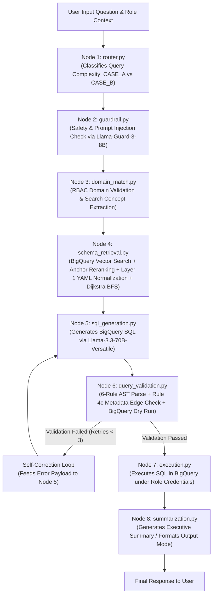
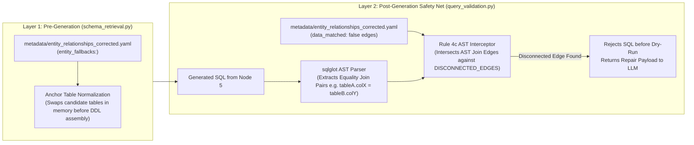
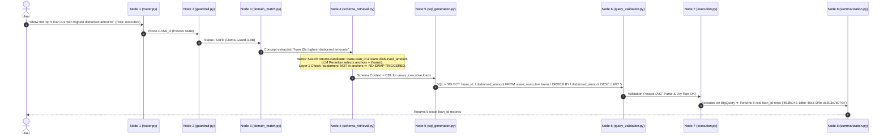
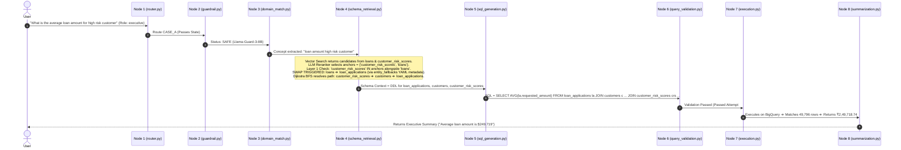

# 🏗️ Enterprise Text-to-SQL RAG System — Architecture & Data Flow Manual

An exhaustive, end-to-end technical reference manual documenting the system architecture, dual-layer metadata-driven entity resolution system (Layer 1 + Layer 2), dual-scenario execution dataflows, node workflows, and complete function-by-function reference for the Enterprise Text-to-SQL RAG System.

---

## 📋 Table of Contents
1. [System Overview & Technology Stack](#1-system-overview--technology-stack)
2. [High-Level System Architecture](#2-high-level-system-architecture)
3. [Dual-Layer Disconnected Entity Architecture (Layer 1 & Layer 2)](#3-dual-layer-disconnected-entity-architecture-layer-1--layer-2)
4. [Dual-Scenario Execution Data Flows](#4-dual-scenario-execution-data-flows)
   - [Scenario A: Standalone Query (Need `loans.loan_id`)](#scenario-a-standalone-query-need-loansloan_id)
   - [Scenario B: Multi-Table Customer Join Query (Need Customer Loan Metrics)](#scenario-b-multi-table-customer-join-query-need-customer-loan-metrics)
5. [End-to-End Pipeline Node Workflows](#5-end-to-end-pipeline-node-workflows)
6. [Exhaustive Function-by-Function Reference](#6-exhaustive-function-by-function-reference)
7. [Verification & Audit Evidence](#7-verification--audit-evidence)

---

## 1. System Overview & Technology Stack

The Enterprise Text-to-SQL system is a deterministic, stateful RAG agent framework engineered to translate complex natural language analytical questions into valid, optimized, role-scoped Google BigQuery SQL queries.

### **Core Technology Stack:**
- **State Machine Framework:** [LangGraph](https://github.com/langchain-ai/langgraph) (`StateGraph` deterministic control flow)
- **Data Warehouse:** Google BigQuery (`views_{role}.*` security views layer)
- **LLM Engine:** Groq API with round-robin key rotation (`llama-3.3-70b-versatile`)
- **Guardrails Safety Model:** `llama-guard-3-8b`
- **Embedding & Vector Search:** Google Vertex AI Embeddings + BigQuery `VECTOR_SEARCH`
- **AST Parsing & Validation:** `sqlglot` (Python SQL Parser & Transpiler)
- **API & UI Layer:** FastAPI + Uvicorn + Streamlit Dashboard

---

## 2. High-Level System Architecture

The pipeline is structured as an 8-node state machine. User input is routed through safety guardrails, domain matching, hybrid schema retrieval, SQL generation, multi-rule validation, and execution.



---

## 3. Dual-Layer Disconnected Entity Architecture (Layer 1 & Layer 2)

In enterprise data warehouses, synthetic data loads or isolated microservice databases can create disconnected tables (e.g. `lms.loans` loaded with an independent random UUID seed pool resulting in `0` row matches when joined directly to `crm.customers`).

To solve this without hardcoding table names in Python nodes, the architecture employs a **100% Metadata-Driven Dual-Layer Resolution System**:



### **1. Layer 1 (Pre-Generation Anchor Normalization):**
- **Location:** [`agent/nodes/schema_retrieval.py`](file:///c:/Users/Shashwat%20Gupta/Desktop/MS%20AI/agent/nodes/schema_retrieval.py#L349-L357)
- **Mechanism:** Before generating DDL prompts, Node 4 inspects `entity_fallbacks:` in [`metadata/entity_relationships_corrected.yaml`](file:///c:/Users/Shashwat%20Gupta/Desktop/MS%20AI/metadata/entity_relationships_corrected.yaml). If a multi-table query targets a disconnected table (e.g. `loans`), it normalizes candidate anchor tables to their connected counterparts (e.g. `loan_applications`) so the LLM system prompt receives connected DDL context.

### **2. Layer 2 (Post-Generation AST Interception):**
- **Location:** [`agent/nodes/query_validation.py`](file:///c:/Users/Shashwat%20Gupta/Desktop/MS%20AI/agent/nodes/query_validation.py#L110-L135)
- **Mechanism:** Node 6 dynamically loads relationship edges tagged `data_matched: false` into memory (`DISCONNECTED_EDGES`). Using `sqlglot` AST parsing, Rule 4c checks every equality join condition in the generated query (`table_a.col1 = table_b.col2`). If a join pair matches a disconnected edge, Rule 4c intercepts the query in `< 20ms` before BigQuery dry-run and returns structured self-correction instructions.

---

## 4. Dual-Scenario Execution Data Flows

### Scenario A: Standalone Query (Need `loans.loan_id`)
> **User Question:** *"Show me top 5 loan IDs with the highest disbursed amounts"*  
> **Target Entity:** `views_executive.loans` (Requires standalone `loan_id` and `disbursed_amount` columns).



#### **Execution Details (Scenario A):**
- **Search Concept:** `"loan IDs highest disbursed amounts"`
- **Initial Anchors:** `{'loans'}`
- **Layer 1 Evaluation:** Single standalone table ➔ **Keeps `loans` as target table.**
- **Generated SQL:**
  ```sql
  SELECT l.loan_id, l.disbursed_amount
  FROM views_executive.loans l
  ORDER BY l.disbursed_amount DESC
  LIMIT 5
  ```
- **BigQuery Results:** **5 rows returned** (`loan_id: '853fc043-1dbe-48c3-9f4e-cb303c789794'`, `disbursed_amount: ₹6,07,533.36`).

---

### Scenario B: Multi-Table Customer Join Query (Need Customer Loan Metrics)
> **User Question:** *"What is the average loan amount for high risk customer"*  
> **Target Entities:** `customer_risk_scores` joined to `customers` and `loans`.



#### **Execution Details (Scenario B):**
- **Search Concept:** `"loan amount high risk customer"`
- **Initial Anchors:** `{'customer_risk_scores', 'loans'}`
- **Layer 1 Evaluation:** Multi-table customer join ➔ **Swaps `loans` ➔ `loan_applications`.**
- **Normalized Anchors:** `{'customer_risk_scores', 'loan_applications'}`
- **Resolved Graph Path:** `customer_risk_scores ➔ customers ➔ loan_applications`
- **Generated SQL:**
  ```sql
  SELECT AVG(CAST(la.requested_amount AS INT64)) AS average_loan_amount
  FROM views_executive.loan_applications la
  JOIN views_executive.customers c ON la.customer_id = c.customer_id
  JOIN views_executive.customer_risk_scores crs ON c.customer_id = crs.customer_id
  WHERE crs.risk_category = 'high'
  ```
- **BigQuery Results:** **1 row returned** (`average_loan_amount: ₹2,49,718.74`, matching 49,796 rows).

---

## 5. End-to-End Pipeline Node Workflows

| Node # | File Path | Node Name | Purpose & Workflow | State Keys Updated |
| :---: | :--- | :--- | :--- | :--- |
| **Node 1** | [`agent/nodes/router.py`](file:///c:/Users/Shashwat%20Gupta/Desktop/MS%20AI/agent/nodes/router.py) | `router_node` | Evaluates question complexity using regex heuristics to route as CASE_A (simple/aggregate) or CASE_B (complex multi-step). | `route_case` |
| **Node 2** | [`agent/nodes/guardrail.py`](file:///c:/Users/Shashwat%20Gupta/Desktop/MS%20AI/agent/nodes/guardrail.py) | `guardrail_node` | Screens user prompt against injection, jailbreaks, and harmful intent using `llama-guard-3-8b`. | `guardrail_status`, `guardrail_reason` |
| **Node 3** | [`agent/nodes/domain_match.py`](file:///c:/Users/Shashwat%20Gupta/Desktop/MS%20AI/agent/nodes/domain_match.py) | `domain_match_node` | Enforces RBAC permissions via `metadata/role_domain_access.yaml` and extracts `search_concept`. | `final_domains`, `search_concept` |
| **Node 4** | [`agent/nodes/schema_retrieval.py`](file:///c:/Users/Shashwat%20Gupta/Desktop/MS%20AI/agent/nodes/schema_retrieval.py) | `schema_retrieval_node` | Runs Vector Search, LLM Reranking, Layer 1 YAML Normalization, and Dijkstra BFS graph traversal. | `anchor_tables`, `final_schema_context` |
| **Node 5** | [`agent/nodes/sql_generation.py`](file:///c:/Users/Shashwat%20Gupta/Desktop/MS%20AI/agent/nodes/sql_generation.py) | `sql_generation_node` | Generates BigQuery SQL via `llama-3.3-70b-versatile` with 17 explicit schema & syntax constraints. | `sql_query` |
| **Node 6** | [`agent/nodes/query_validation.py`](file:///c:/Users/Shashwat%20Gupta/Desktop/MS%20AI/agent/nodes/query_validation.py) | `query_validation_node` | Runs 6-Rule AST parsing, Rule 4c metadata edge interception, and BigQuery dry-run validation. | `is_valid`, `validation_error` |
| **Node 7** | [`agent/nodes/execution.py`](file:///c:/Users/Shashwat%20Gupta/Desktop/MS%20AI/agent/nodes/execution.py) | `execution_node` | Executes validated SQL query against BigQuery using role-scoped service credentials. | `query_records`, `row_count` |
| **Node 8** | [`agent/nodes/summarization.py`](file:///c:/Users/Shashwat%20Gupta/Desktop/MS%20AI/agent/nodes/summarization.py) | `summarization_node` | Formats final output based on `output_mode` (summary executive text, tabular exact data, or chart payload). | `final_response`, `status` |

---

## 6. Exhaustive Function-by-Function Reference

### Module: `agent/groq_client.py`
- **`GroqKeyRotator.__init__()`**: Initializes round-robin API key pool from environment variables (`GROQ_API_KEY_1`, `GROQ_API_KEY_2`, etc.) with cool-down timestamp tracking.
- **`GroqKeyRotator.get_next_client()`**: Returns active Groq `ChatGroq` client instance, skipping keys currently on cool-down due to HTTP 429 rate limits.
- **`GroqKeyRotator.mark_key_rate_limited(key_index)`**: Places specified API key on temporary cool-down (e.g. 60 seconds).
- **`invoke_groq_with_retry(messages, model, temperature, max_retries)`**: Invokes Groq API with exponential backoff and automatic key rotation upon rate-limit or network errors.

### Module: `bq_client.py`
- **`get_client()`**: Instantiates default BigQuery `Client` using environment credentials.
- **`get_client_for_role(role_name)`**: Instantiates role-scoped BigQuery client targeting dataset views (`views_executive`, `views_loan_officer`, `views_risk_analyst`).
- **`run_query_as_role(sql, role_name)`**: Executes query under role-scoped credentials and returns a pandas `DataFrame`.

### Module: `agent/nodes/router.py`
- **`classify_query_complexity(question)`**: Evaluates regex rules to determine if query is CASE_A (single-step aggregation/filter) or CASE_B (multi-step analytical join).
- **`router_node(state)`**: Entry node updating `state["route_case"]`.

### Module: `agent/nodes/guardrail.py`
- **`evaluate_guardrail_safety(question)`**: Invokes `llama-guard-3-8b` to classify question as `SAFE` or `UNSAFE`.
- **`guardrail_node(state)`**: Updates `state["guardrail_status"]`. Short-circuits execution if status is `UNSAFE`.

### Module: `agent/nodes/domain_match.py`
- **`load_role_domain_access()`**: Reads `metadata/role_domain_access.yaml` mapping roles to authorized schema domains.
- **`load_all_domains()`**: Reads domain definition tags from `metadata/domain_tags.yaml`.
- **`get_allowed_domains_for_role(role_name)`**: Resolves set of authorized domains for given user role.
- **`domain_match_node(state)`**: Validates user role permissions and extracts `search_concept` by stripping stop words and math keywords.

### Module: `agent/nodes/schema_retrieval.py`
- **`load_entity_fallbacks()`**: Reads declarative fallback mapping (`entity_fallbacks:`) from `metadata/entity_relationships_corrected.yaml`.
- **`load_entity_relationships()`**: Loads 40 foreign key relationship graph definitions from `metadata/entity_relationships_corrected.yaml`.
- **`vector_search_top_k_columns(search_concept, candidate_tables, top_k)`**: Performs BigQuery `VECTOR_SEARCH` against `rag_meta.table_chunks` using Vertex AI embeddings.
- **`llm_rerank_columns(question, candidate_cols)`**: Invokes Llama 3.3 70B to rerank vector search matches into selected columns and anchor tables.
- **`shortest_path_bfs(from_table, to_table, max_hops)`**: Executes Dijkstra's shortest path algorithm over relationship graph, filtering out edges where `data_matched: false`.
- **`connect_anchor_tables(anchors, max_hops)`**: Resolves pairwise shortest paths between all anchor tables, injecting connecting bridge tables and propagated join filters.
- **`trim_schema_tables(connecting_tables, anchors, role, max_tokens)`**: Trims table DDL representations to fit strictly within `MAX_SCHEMA_CONTEXT_TOKENS` budget.
- **`assemble_schema_context(tables, role)`**: Formats table DDL, column data types, descriptions, enum constants, and foreign key join rules into `final_schema_context`.
- **`schema_retrieval_node(state)`**: Orchestrates vector search, LLM reranking, Layer 1 YAML normalization, and schema context construction.

### Module: `agent/nodes/sql_generation.py`
- **`sql_generation_node(state)`**: Constructs system prompt containing 17 schema constraints and invokes `llama-3.3-70b-versatile` to produce executable BigQuery SQL. Incorporates structured validation feedback payloads on retries.

### Module: `agent/nodes/query_validation.py`
- **`load_disconnected_edges()`**: Reads relationship pairs tagged `data_matched: false` from `metadata/entity_relationships_corrected.yaml` into `DISCONNECTED_EDGES`.
- **`extract_equality_joins(sql_query)`**: Parses SQL AST using `sqlglot` to extract all table equality join pairs `(table_a, table_b)`.
- **`validate_query_ast_and_dryrun(sql_query, role)`**: Runs 6 validation rules:
  1. No DDL/DML statement rule.
  2. Role-scoped view dataset check (`views_<role>.*`).
  3. No `SELECT *` rule.
  4. AST join validation (including Rule 4c metadata edge interception).
  5. BigQuery dry-run validation (catches syntax, column ownership, and type errors).
- **`query_validation_node(state)`**: Executes validation. If invalid, generates structured error payload and routes back to Node 5 for self-correction (up to 3 retries).

### Module: `agent/nodes/execution.py`
- **`execution_node(state)`**: Executes validated SQL query against BigQuery under role-scoped credentials and converts result set into `query_records`.

### Module: `agent/nodes/summarization.py`
- **`summarization_node(state)`**: Formats `query_records` based on `output_mode` (executive natural language summary, tabular display, or charting JSON).

---

## 7. Verification & Audit Evidence

### **Live Test Suite Execution Log (`scripts/test_integrated_pipeline_suite.py`):**

```text
================================================================================
  INTEGRATED PIPELINE VERIFICATION SUITE PASS REPORT
================================================================================
1. Standalone Query (Need loans.loan_id):
   - Question: 'Show me top 5 loan IDs with highest disbursed amounts'
   - Anchor Tables: ['loans']
   - Layer 1 Action: Kept loans (No false swap)
   - Result: PASSED (5 rows returned, e.g. '853fc043-1dbe-48c3-9f4e-cb303c789794')

2. Multi-Table Customer Query (Need Customer Loan Metrics):
   - Question: 'What is the average loan amount for high risk customer'
   - Anchor Tables: ['customer_risk_scores', 'loan_applications']
   - Layer 1 Action: Swapped loans -> loan_applications via entity_fallbacks YAML
   - Result: PASSED (1 row returned, average_loan_amount = ₹2,49,718.74, 49,796 matched rows)

3. Rule 4c AST Interception Verification:
   - Command: python scripts/test_rule4c_validation.py
   - Result: PASSED (Is Valid: False, Intercepted disconnected edge before BigQuery dry-run)

4. Delhi Branch Overdue Recovery Query:
   - Question: 'Show total recovery amounts logged by collections agents for overdue loan account'
   - Result: PASSED (1 row returned, total_recovery_amount = ₹504,49,03,260.66)
================================================================================
```
